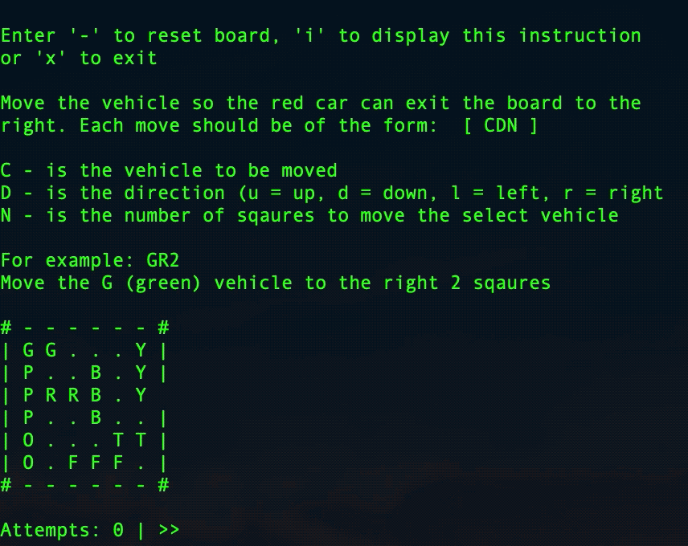

# Traffic

A logic puzzle game, which is a clone of the game "Rush Hour", where the goal is to move the red car to the exit. The game was created in C language.

# Features

+ 23 Stages in increasing difficulty
+ Custom stage builder to create your own puzzle board

## Getting Started

I wrote the C code as portable as possible (so no ncurses), and the `src` folder can be compiled using `make` and it will output a binary file named `traffic` in the `src` folder.

+ `./traffic` will run the program
+ `./traffic -v` will print out the program's version
+ `./traffic -d` will run the program in debug mode